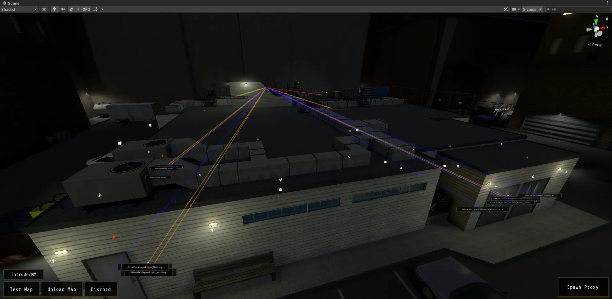
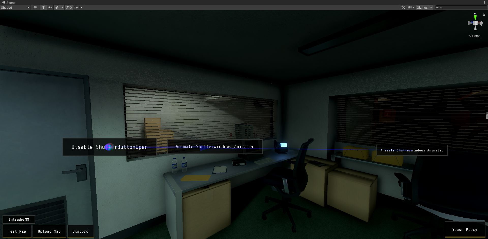
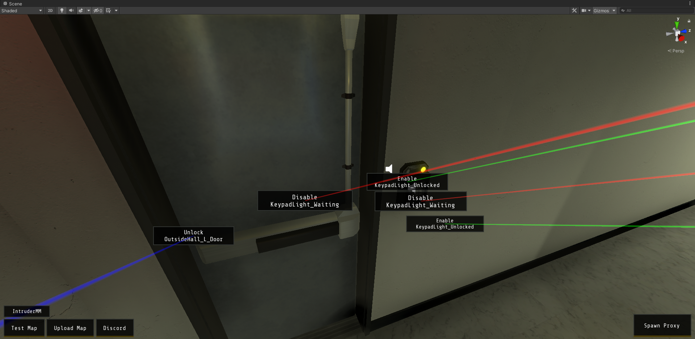
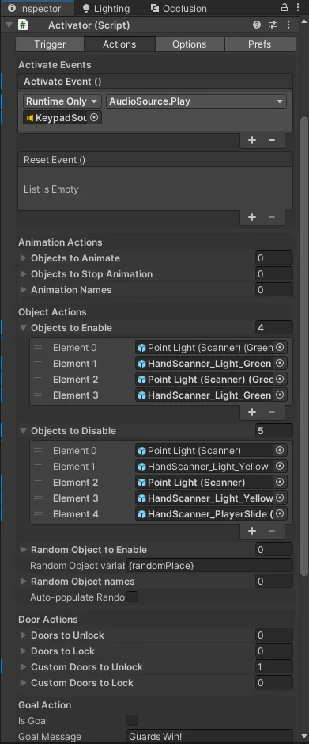
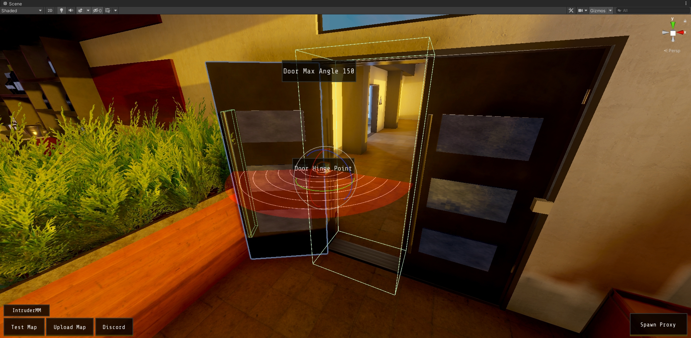
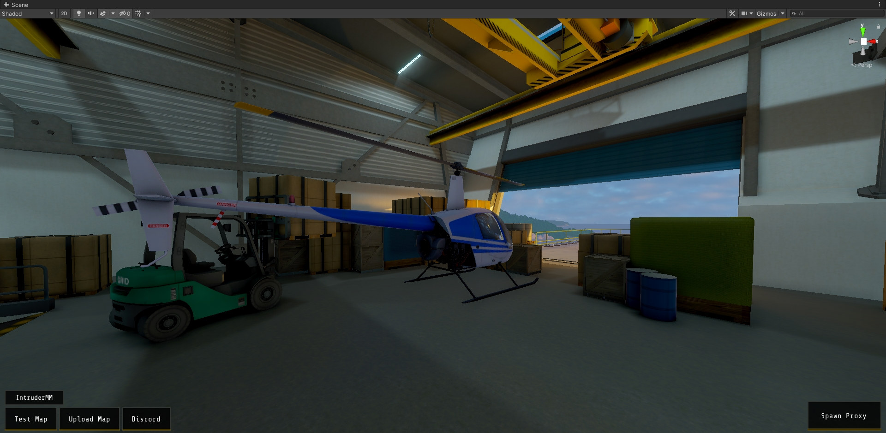
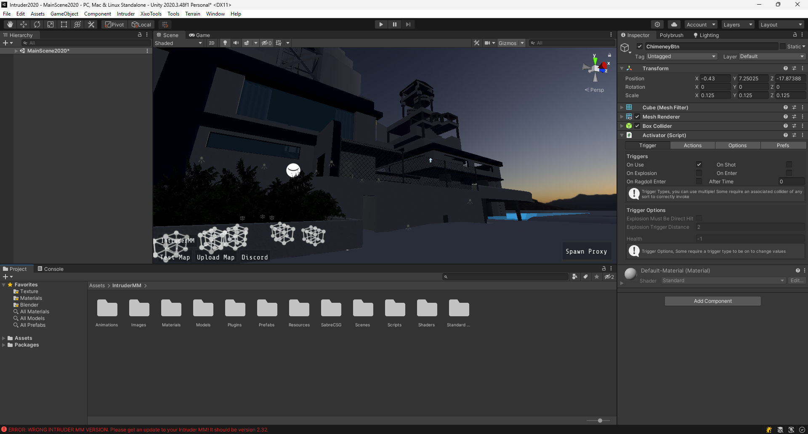
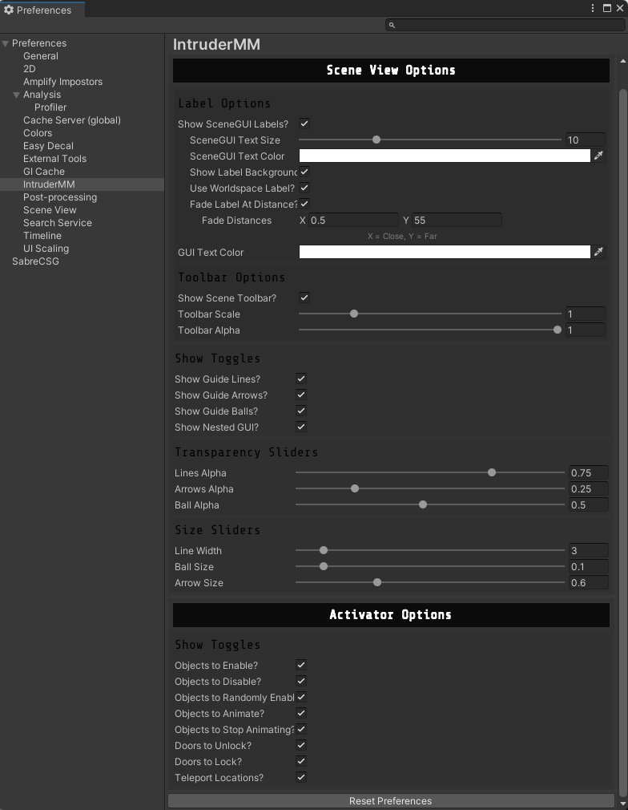

## Why did I make it
At the time I was making intruder maps and it really annoyed me how much trial and error there was to figuring out certain things.
Before the update if you wanted to test a door angle you would have to build the asset bundle for the map to test it then obviously 
you need to go to the door in the map and see if its correct. 

Or alternatively with Activators, to me it was really hard to keep track of what Activators were doing since at the time they were not
modular (being able to call an activator from another activator) it would usually turn into a spaghetti mess of references in the inspector.

## Activator Editor
An activator is a piece of (already defined) action that gets executed via a trigger. An action could be, unlock door, 
animate objects, enable/disable objects, etc. A trigger could be, on collision enter / exit, On use, on shoot, on explosion, etc.

What I did was add a scene view overlay that showed the connections between activator and its actions. As well as update the inspector
UI to be easier to understand. As before it was using the default inspector with no custom OnInspectorGUI.

Inspector

## Door Editor
I made a simple scene overlay to the door editor which shows where the door will open to using an Arc handle and a little bit of information
about the door.

## Scene Overlay
The blanket scene overlay that has buttons for building, uploading, discord and spawning proxies is there to provide an easier experience for
newer map makers who are not familiar with unity.

## User settings
Obviously some of the more competent users of the map maker would not like the overlay and other default settings. So I provided a couple 
settings in the editor preferences to change how the map maker looks.

## Notes
Thank you Mattbatt56 and Xixo for the screenshots :)